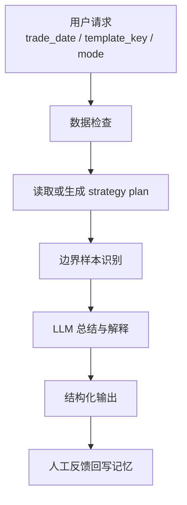

# Strategy Agent 方案设计

## 1. 目标

基于现有 `stock_analysis` 项目，落一个可运行的“策略执行 Agent”工程。

这个 Agent 的定位不是自动交易，而是站在当前评分、回测、实时计划能力之上的“编排与解释层”，主要负责：

- 检查当天数据是否完整可用
- 生成或读取最新策略计划
- 输出买入候选、卖出提示、减仓提示
- 对边界样本给出复核建议
- 沉淀人工反馈，为后续参数优化和策略调优提供记忆

第一版优先追求：

- 可落地
- 可解释
- 可复用现有代码
- 风险可控

不追求第一版就具备：

- 自动下单
- 完全自主调参
- 一个 Agent 包打天下

---

## 2. 为什么这个方向最合适

`stock_analysis` 现在已经具备比较完整的确定性能力链路：

1. 扫描与行情更新
2. 每日因子和评分预计算
3. 历史回填
4. 回测
5. 参数优化与 LLM 复盘
6. 实时策略计划

也就是说，系统现在最缺的不是一个“会聊天的模型”，而是一层“会调度已有能力、会解释结果、会沉淀反馈”的 Agent。

所以 Agent 最合理的切入点是：

- 以实时策略计划为主线
- 以现有 `service.py` 和 `backtest_runner.py` 为核心工具层
- 以 LLM 做解释、决策编排和边界复核
- 以本地记忆保存人工反馈和经验偏置

---

## 3. Agent 定位

建议将第一版 Agent 命名为：

- `StrategyAgent`

它只做一件事：

“围绕某个交易日和某个策略模板，生成可执行、可解释、可复核的策略建议。”

典型输入：

- `trade_date`
- `template_key`
- 可选用户目标
  - `收益优先`
  - `稳健优先`
  - `减少回撤`
  - `仅看持仓处理`

典型输出：

- 市场状态
- 建议总仓位
- 今日买入候选
- 今日卖出/减仓提示
- 当前持仓状态
- 需人工复核的边界票
- 一段文字总结

---

## 4. 第一版职责边界

### 4.1 Agent 负责的事

- 判断是否需要先刷新或回填数据
- 调用策略计划生成能力
- 对结果做自然语言总结
- 对边界样本进行二次解释
- 输出结构化结果，供前端或后续接口使用
- 记录人工确认或否决结果

### 4.2 Agent 不负责的事

- 不直接修改评分公式
- 不直接生成原始行情数据
- 不直接决定回测引擎规则
- 不绕过模板和风控约束
- 不直接自动下单

### 4.3 决策原则

- 确定性规则优先
- LLM 只做编排、解释、复核和摘要
- 高风险动作必须能追溯原因
- 人工确认应当能反哺记忆

---

## 5. 建议的工程结构

建议在这个新工程下按下面结构推进：

```text
strategy_agent_project/
├─ README.md
├─ docs/
│  └─ strategy_agent_方案设计.md
├─ src/
│  └─ strategy_agent/
│     ├─ __init__.py
│     ├─ agent.py
│     ├─ graph.py
│     ├─ state.py
│     ├─ prompts.py
│     ├─ tools/
│     │  ├─ market_tools.py
│     │  ├─ strategy_tools.py
│     │  ├─ backtest_tools.py
│     │  └─ memory_tools.py
│     ├─ memory/
│     │  ├─ models.py
│     │  ├─ repository.py
│     │  └─ serializer.py
│     └─ schemas/
│        ├─ input.py
│        └─ output.py
└─ tests/
   ├─ test_tools.py
   ├─ test_agent_flow.py
   └─ test_memory.py
```

说明：

- `src/strategy_agent/tools/` 只做对 `stock_analysis` 现有能力的薄封装
- `agent.py` 负责主入口
- `graph.py` 负责流程编排
- `memory/` 负责本地经验和人工反馈沉淀
- `schemas/` 负责输入输出结构约束

---

## 6. 推荐的 Agent 流程

第一版建议把流程控制在 6 步内：

1. 接收任务输入
2. 检查数据是否可用
3. 生成或读取最新策略计划
4. 识别边界样本
5. 生成解释和摘要
6. 返回结构化结果并记录反馈入口

可以抽象成下面这条链路：



---

## 7. Tool 设计

Agent 不应该直接写 SQL，也不应该自己理解底层表结构后胡乱拼数据。

建议把 `stock_analysis` 的现有能力封装为清晰工具。

### 7.1 必备工具

#### `get_latest_trade_date`

作用：

- 获取可用的最新交易日

#### `check_daily_data_ready`

作用：

- 检查某日 `daily_score`、`daily_factor`、`market_snapshot` 是否齐全
- 给出 `ready / needs_backfill / missing_snapshot` 等状态

#### `generate_strategy_plan`

作用：

- 调用现有 `service.generate_strategy_plan(...)`
- 返回计划主信息、买卖信号、持仓动作

#### `get_strategy_positions`

作用：

- 读取某日持仓快照

#### `get_stock_detail`

作用：

- 对边界票补充详情
- 包括评分拆解、因子、近期行情、板块、大盘

#### `record_human_feedback`

作用：

- 记录用户对某条建议的确认、跳过、否决

### 7.2 第二阶段工具

#### `run_backtest`

- 当用户要求复盘模板效果时触发

#### `review_with_llm`

- 借鉴现有 optimizer 的 review 机制

#### `propose_template_adjustment`

- 生成下一轮模板微调建议

---

## 8. 状态机设计

建议 Agent 内部使用显式状态对象，避免流程失控。

参考状态字段：

```json
{
  "request_id": "uuid",
  "trade_date": "2026-03-27",
  "template_key": "return_priority",
  "mode": "daily_brief",
  "data_status": "ready",
  "plan_generated": true,
  "market_status": "open",
  "target_exposure": 1.0,
  "buy_candidates": [],
  "sell_signals": [],
  "trim_signals": [],
  "positions": [],
  "watchlist": [],
  "needs_review_symbols": [],
  "summary": "",
  "memory_hints": [],
  "errors": []
}
```

这样后续无论用普通函数编排、LangGraph、LangChain AgentExecutor，状态都比较稳。

---

## 9. 边界样本识别规则

第一版最值得加入的 Agent 增益，不是“更聪明地推荐买卖”，而是“更聪明地识别不确定样本”。

可以先把这些票标成 `needs_review_symbols`：

- 总分接近买入阈值，但未入选
- 卖出规则触发，但当前涨幅趋势仍强
- 减仓和清仓条件都接近
- 大盘过滤刚好在临界点附近
- 评分高，但成交额或板块强度不足

Agent 对这些票做的动作是：

- 给出解释
- 提示风险
- 请求人工复核

而不是直接推翻既有规则。

---

## 10. 记忆设计

你这个项目已经有“参数优化 + LLM 记忆闭环”的现成经验，策略 Agent 也应该复用同样思路。

第一版记忆先不要太复杂，建议只保存 3 类信息：

### 10.1 人工反馈记忆

- 哪些买入建议被确认
- 哪些卖出建议被否决
- 哪些建议被标记为“太激进”或“太保守”

### 10.2 模式记忆

- 哪些市场状态下更容易被人工收紧仓位
- 哪些边界票类型经常被否决

### 10.3 解释偏好

- 用户更关注收益、回撤还是稳定性
- 用户更喜欢简洁摘要还是明细解释

建议存储格式：

- SQLite 单表，简单可靠
- 或者先用 JSON 文件

第一版推荐先用 JSON，降低耦合。

---

## 11. 输出结构设计

Agent 输出建议统一为结构化 JSON，再由前端决定如何展示。

参考结构：

```json
{
  "trade_date": "2026-03-27",
  "template_key": "return_priority",
  "market": {
    "status": "open",
    "reason": "平均分和5日均值均达标，大盘站上MA20",
    "target_exposure": 1.0
  },
  "actions": {
    "buy": [],
    "trim": [],
    "sell": [],
    "hold": []
  },
  "watchlist": [],
  "needs_review_symbols": [],
  "summary": "今日市场允许开仓，建议保持进攻型仓位，但边界票需要人工复核。",
  "next_steps": [
    "先看卖出和减仓信号",
    "再按优先级检查买入候选",
    "最后处理边界票"
  ]
}
```

---

## 12. LangChain 可以用吗

可以，用 LangChain 实现是可行的。

但建议是：

- `可以用`
- `不要重度依赖`
- `更不要把业务逻辑写进 prompt`

### 12.1 为什么可以用

LangChain 适合帮你解决这些问题：

- 定义 tools
- 管理结构化输出
- 组织 prompt
- 接入模型
- 做基础 agent orchestration

如果后面你还想做多步骤流程，甚至拆成：

- 数据检查节点
- 策略生成节点
- 边界复核节点
- 反馈写回节点

那 LangGraph 其实比纯 LangChain AgentExecutor 更合适。

### 12.2 为什么不要重度依赖

你的领域逻辑很强，而且已经有大量确定性代码：

- 行情缓存
- 评分
- 回测
- 模板
- 仓位
- 卖出规则

这些都应该继续留在 Python 业务代码里，而不是迁移到 LangChain 的 chain prompt 里。

正确姿势是：

- `stock_analysis` 继续负责确定性计算
- `strategy_agent_project` 负责 tools 和 orchestration
- LangChain 只作为胶水层

### 12.3 推荐技术选型

如果你希望第一版稳一点，我建议：

方案 A：

- LangChain + Structured Output + 普通函数编排

优点：

- 简单
- 容易调试
- 成本低

适合第一版。

方案 B：

- LangGraph + tools + 显式状态机

优点：

- 更适合多步骤 Agent
- 更适合后续扩展记忆、复核、异常恢复

适合第二版或直接一步到位。

### 12.4 不推荐的做法

- 不要一开始就做 ReAct 大循环自由调用几十个工具
- 不要让模型自己决定底层 SQL
- 不要让 LangChain 侵入原有 `stock_analysis` 核心模块

---

## 13. 第一版技术实现建议

### 13.1 最小可行版本

第一版可以只做一个同步入口：

`run_strategy_agent(trade_date: str | None, template_key: str, mode: str = "daily_brief")`

执行逻辑：

1. 检查数据是否完整
2. 如果不完整，返回明确缺口，不自动乱补
3. 如果完整，生成策略计划
4. 识别边界样本
5. 调用 LLM 输出自然语言总结
6. 返回结构化 JSON

### 13.2 结构化输出

模型输出必须绑定 schema。

建议让 LLM 只补充：

- `summary`
- `market_interpretation`
- `review_notes`
- `watch_items`

不要让它生成：

- 原始分数
- 原始仓位
- 原始买卖信号

这些应该来自工具结果。

### 13.3 异常处理

必须定义三类异常：

- 数据不完整
- 工具调用失败
- LLM 失败但工具结果可用

其中第三类不能让整个任务失败，应退化成：

- 返回结构化计划
- 无自然语言摘要

---

## 14. 开发阶段拆分

### 阶段 1

目标：

- 跑通数据检查 + 策略计划 + 摘要输出

交付：

- 基础工程结构
- 3 到 5 个 tools
- 一个同步 Agent 主入口
- 一个 Markdown/JSON 输出样例

### 阶段 2

目标：

- 加入边界样本识别和人工反馈

交付：

- `record_human_feedback`
- `needs_review_symbols`
- 简单记忆存储

### 阶段 3

目标：

- 接入模板复盘与优化建议

交付：

- 回测触发工具
- 与优化器 review 机制对接
- 对模板微调提出建议

### 阶段 4

目标：

- 做成持续运行的研究/执行协同系统

交付：

- 每日自动摘要
- 周度策略复盘
- 模板稳定性跟踪

---

## 15. 推荐的首批文件实现顺序

建议按这个顺序写代码：

1. `schemas/input.py`
2. `schemas/output.py`
3. `tools/strategy_tools.py`
4. `tools/market_tools.py`
5. `state.py`
6. `prompts.py`
7. `agent.py`
8. `tests/test_tools.py`
9. `tests/test_agent_flow.py`

这样可以先把输入输出和工具层做稳，再接 LLM。

---

## 16. 结论

这个 Agent 完全可以用 LangChain 来实现，但更推荐把 LangChain 放在“编排层”，而不是“核心业务层”。

最稳的路线是：

- 现有 `stock_analysis` 不大改
- 新工程只做 agent 封装
- 先做 `StrategyAgent`
- 先服务“每日策略建议和人工复核”
- 后续再扩展到参数优化和研究闭环

一句话总结：

“用 LangChain 可以，但要把它当成胶水，不要把它当成交易系统本身。”
